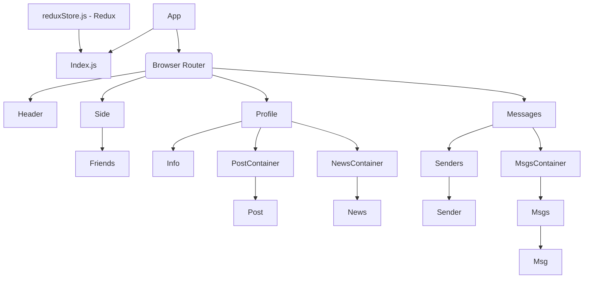

```mermaid

flowchart TD;
00[reduxStore.js - Redux]
    00-->0[Index.js]
    A[App] -->0
A[App] -->B(Browser Router);
B --> D[Header];
B -->E[Side];
B -->F[Profile];
B -->G[Messages];
F -->F1[Info];
F -->F2[PostContainer];
F -->F3[NewsContainer];
G -->G1[Senders];
G -->G2[MsgsContainer];
G1-->G1_1[Sender];
E -->E1[Friends]
 F2 --> PostContainer[Post ];
 F3 --> NewsContainer[News ];
 G2  --> G2_2[Msgs];
 G2_2 --> G_2_2[Msg]


```