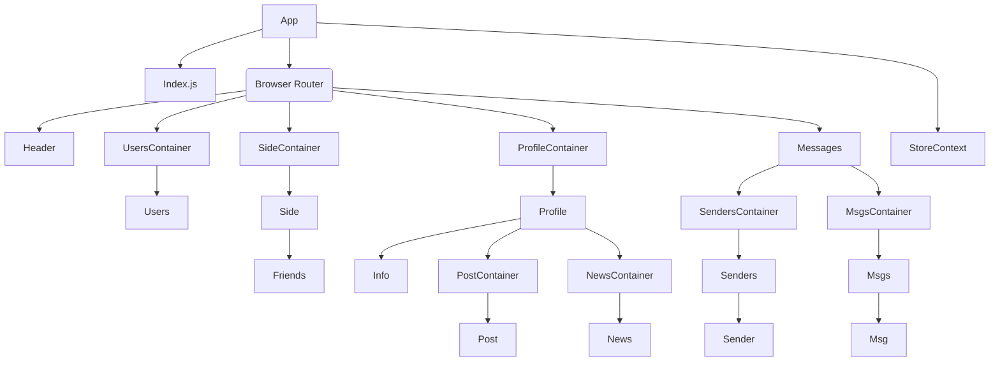

```mermaid


flowchart TD;
    0[Index.js]
    A[App] -->0
A[App] -->B(Browser Router);
B --> D[Header];
B --> C[UsersContainer]
B -->E[SideContainer];
B -->F[ProfileContainer];
B -->G[Messages];
C-->C1[Users]
F[ProfileContainer] -->FF[Profile]
FF -->F1[Info];
FF -->F2[PostContainer];
FF -->F3[NewsContainer];
G[Messages] -->G1[SendersContainer];
G -->G2[MsgsContainer];
G1[SendersContainer]-->G1_1[Senders];
G1_1[Senders] --> G1_2[Sender]
E[SideContainer]-->EE[Side]
EE -->E1[Friends]
 F2 --> PostContainer[Post ];
 F3 --> NewsContainer[News ];
 G2  --> G2_2[Msgs];
 G2_2 --> G_2_2[Msg]
 A[App] --->A1[StoreContext]


```